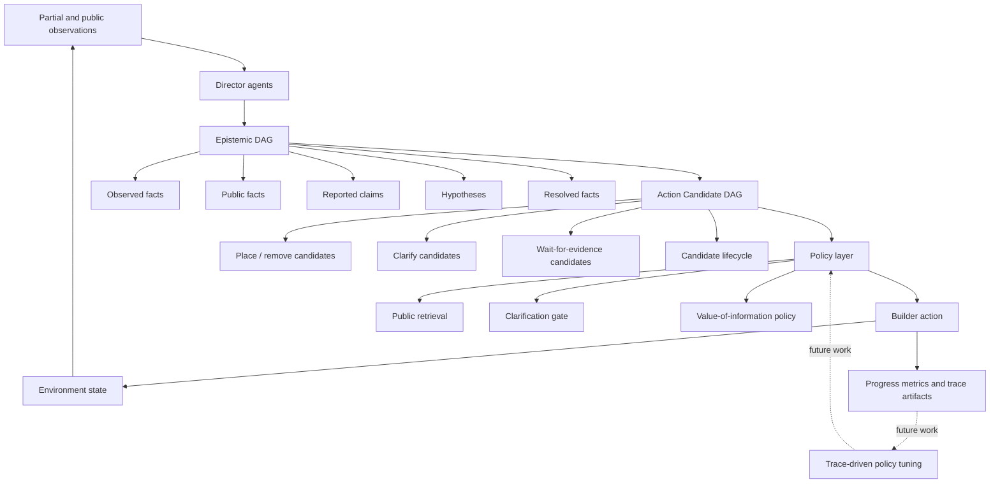

# Dual-DAG Current Research Model

This document summarizes the current Dual-DAG research model for proposal figures and model explanation. Dual-DAG is the proposed coordination and memory model. Model improvement and policy tuning are planned future work driven by trace analysis and evaluation results.

## Core Idea

Dual-DAG separates two kinds of state that are often mixed together in multi-agent LLM coordination:

- `Epistemic DAG`: what agents know, claim, hypothesize, or resolve under partial information.
- `Action Candidate DAG`: what the Builder can do, why each action is supported or blocked, and whether an action is executable.

The goal is to avoid converting private or uncertain observations directly into actions. Instead, Dual-DAG externalizes uncertainty, links actions to public evidence, and gates costly communication such as clarification.

## Current Model Figure

## Current Execution Path

1. Directors receive partial observations and produce public messages.
2. Public observations, Director claims, hypotheses, and resolved facts are recorded in the `Epistemic DAG`.
3. Candidate Builder actions are represented in the `Action Candidate DAG` with support, conflict, required-evidence, confidence, and lifecycle metadata.
4. The policy layer uses public graph state to choose between physical action, clarification, waiting for evidence, or retrieval-supported action scoring.
5. Builder actions update the public environment state and create new public evidence for later turns.
6. Normalized traces and metrics are used to diagnose throughput, progress, clarification outcomes, fallback, retrieval, and leakage safety.

## Implemented Components

The current CRAFT implementation includes:

- Epistemic metadata for observed facts, public facts, reported claims, hypotheses, and resolved facts.
- Action candidate metadata for support, conflict, required evidence, confidence, and candidate state.
- Runtime Dual-DAG artifacts with nodes, edges, summaries, snapshots, and public retrieval.
- Gated clarification and value-of-information clarification policy variants.
- Clarification outcome and efficiency metrics.
- Partial-information leakage checks for prompts and artifacts.
- CRAFT-to-Task-DAG read-only projection and Minecraft read-only artifact support.

## Future Improvement Loop

The dashed loop in the figure is future work, not a currently learned self-improvement mechanism. Future improvement should use empirical traces to refine the policy layer while preserving partial-information safety.

Planned refinement targets include:

- Trace-level comparison between Clarify-disabled Dual-DAG and value-of-information Clarify.
- Better action-selection diagnostics when throughput is preserved but progress drops.
- Policy tuning for value-of-information thresholds and remaining-turn opportunity cost.
- Broader replication across structures, seeds, and horizons before changing defaults.
- Investigation of why retrieval remains inactive in current CRAFT evaluations.

## Current Finding Summary

Recent CRAFT evaluations show that naive Clarify policies can over-use communication and reduce physical-action throughput. The value-of-information policy avoids failed Clarify outcomes and preserves throughput, but it is still an opt-in candidate because it does not consistently beat Clarify-disabled Dual-DAG across sensitivity settings.

Therefore, the current research claim should be framed as:

> Dual-DAG provides a structured coordination and memory model for partial-information multi-agent tasks. It supports evidence-linked action selection, clarification control, and traceable evaluation. Future work will improve the policy layer using trace-level diagnostics and broader empirical validation.
